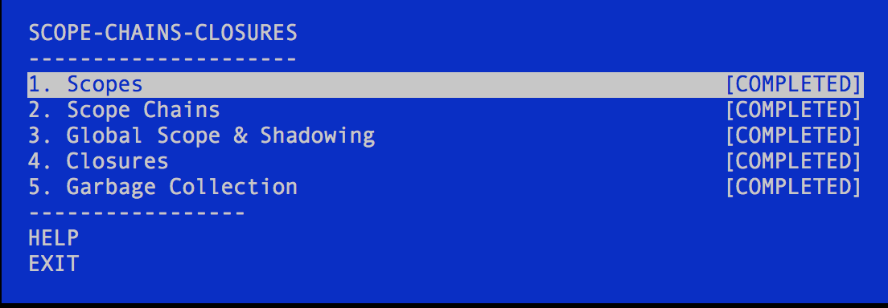

## nodeschool

### learnyounode

- 100% completed all the learnyounode exercises,
- Needs:
    - Refactoring
    - More ES6
  
### scope-chain-closures

- 100% completed
    
  
- Needs ES6 refactoring

### functional-javascript

- Started exercises

### next : stream_adventure

