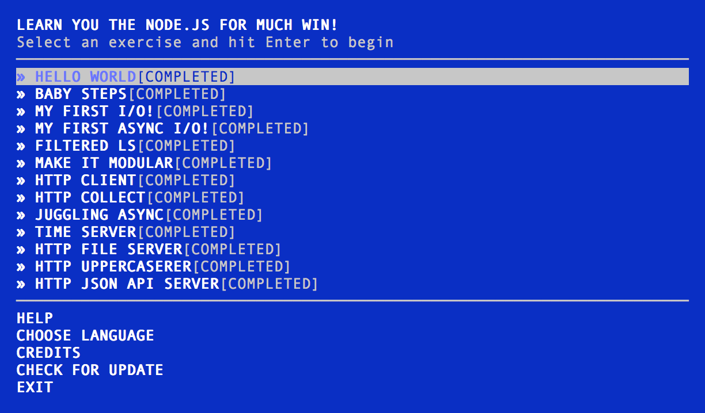

## nodeschool

### learnyounode

- 100% completed all the learnyounode exercises,
- Needs Refactoring & ES6

### scope-chain-closures

- 100% completed
- Needs Refactoring & ES6

### functional-javascript

- Started exercises

### next : stream_adventure
